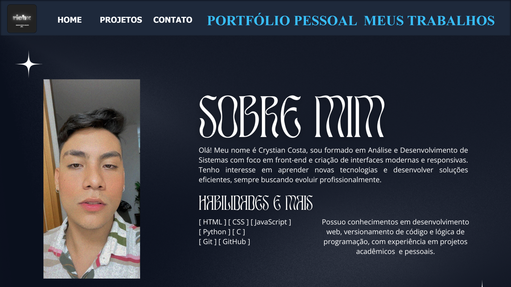
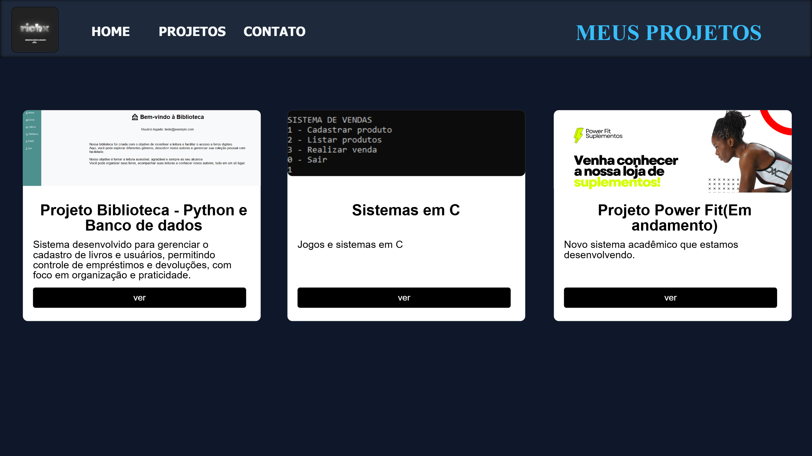
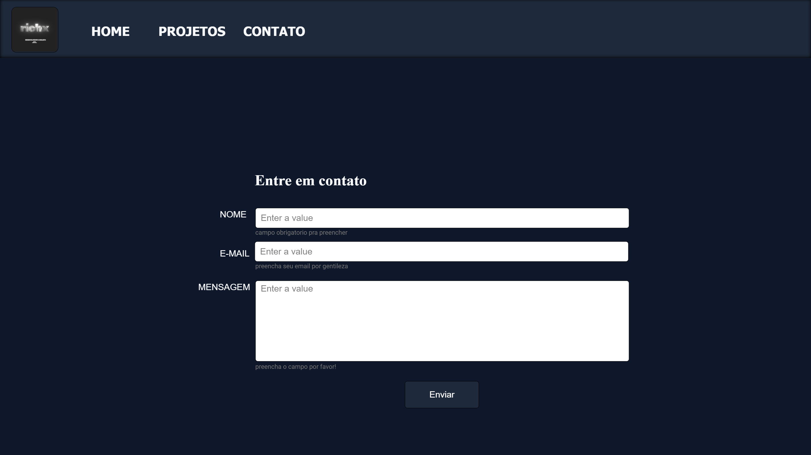
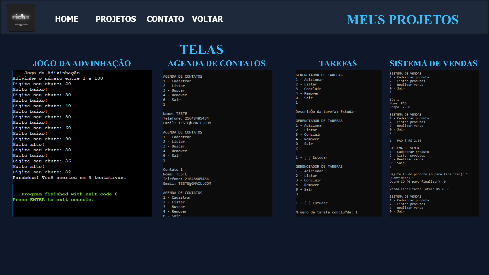
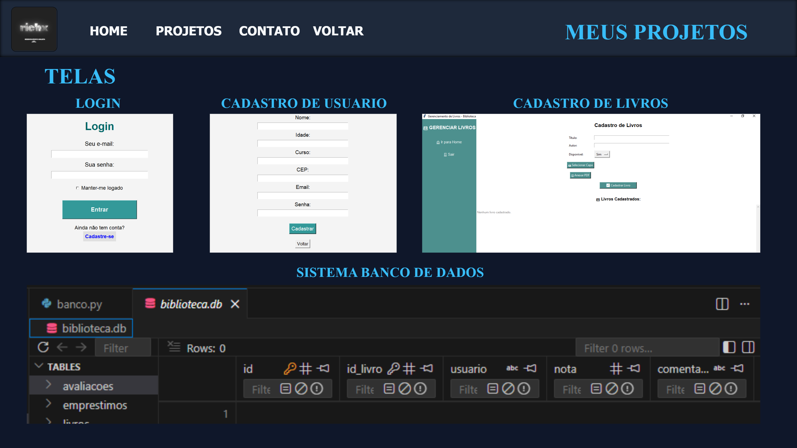
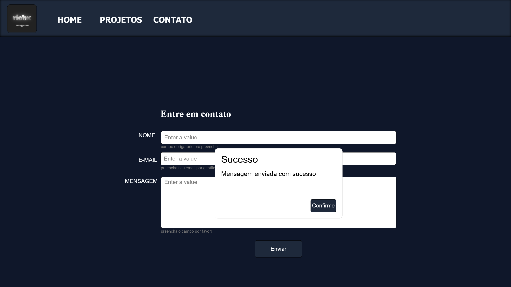

# Portfólio - Crystian

Meu portfólio pessoal desenvolvido com HTML CSS e JS.

## Sobre o Projeto
## 📐 Planejamento – Wireframe

O layout do portfólio foi planejado previamente utilizando Quant-UX.

link: https://app.quant-ux.com/#/test.html?h=a2aa10aLcHt2SyDK59aVLYmwJnXTexFF1EjZsAEmmSknjgPz5AfKnF15fyca&ln=en

Este projeto foi criado para apresentar meus trabalhos, habilidades e formas de contato.

O site contém:

- Página Inicial
- Página de Projetos
- Página de Contato
- Layout responsivo
- Efeito de hover
- Modal para visualizar imagens dos projetos

## Tecnologias Utilizadas

- HTML5
- CSS3
- Flexbox
- Grid Layout

## Objetivo

Praticar desenvolvimento front-end e criar minha presença online como desenvolvedor.

## Contato

- Email: crystian.com.br@gmail.com

---

© 2026 - Crystian
